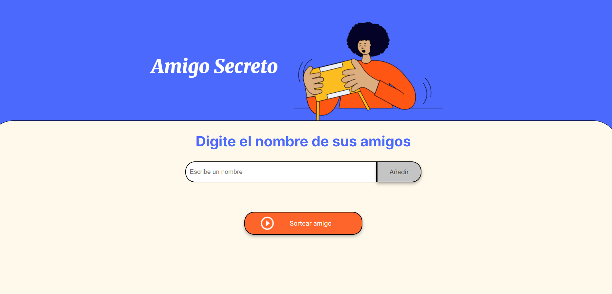

# Challenge Alura Latam

Repositorio general con los proyectos del programa. Incluye una app web de "Amigo Secreto" y un analisis de ventas en Data Science.

## Proyectos

- [challenge-amigo-secreto/](challenge-amigo-secreto/): app web para sortear un amigo secreto.
- [challenge-data-science-latam/](challenge-data-science-latam/): analisis de ventas con Python.

## Captura de pantalla

Pantalla principal de "Amigo Secreto":



## Requisitos

- Para "Amigo Secreto": navegador web.
- Para Data Science: Python, Pandas, Matplotlib.

## Instalacion

```sh
git clone https://github.com/dairxp/challenge-alura-latam
```

## Uso rapido

```sh
cd challenge-alura-latam
```

Luego entra a la carpeta del proyecto que quieras ejecutar.
